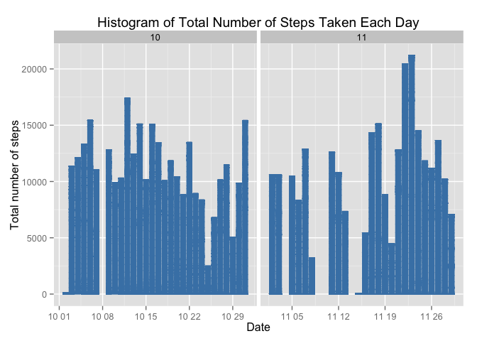
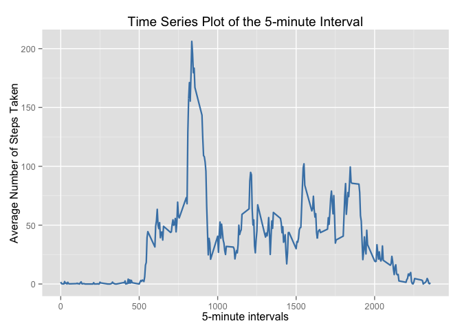
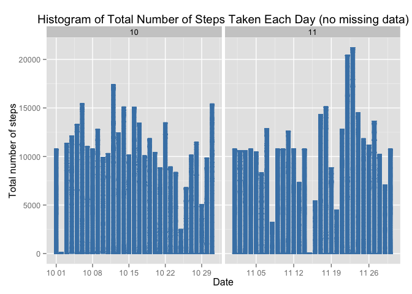

# Reproducible Research: Peer Assessment 1


## Loading and preprocessing the data
###1.Load the data

```r
unzip("activity.zip")
data <- read.csv("/Users/shoubunetou/RepData_PeerAssessment1/activity.csv", colClasses = c("integer", "Date", "factor"))
```
###2.Process/transform the data (if necessary) into a format suitable for your analysis

```r
data$month <- as.numeric(format(data$date, "%m"))
noNA <- na.omit(data)
rownames(noNA) <- 1:nrow(noNA)
library(ggplot2)
```

## What is mean total number of steps taken per day?
###For this part of the assignment, you can ignore the missing values in the dataset.  1.Calculate the total number of steps taken per day

```r
totalSteps <- aggregate(noNA$steps, list(Date = noNA$date), FUN ="sum")$x
```
###2.Make a histogram of the total number of steps taken each day

```r
ggplot(noNA, aes(date, steps)) + geom_bar(stat = "identity", color = "steelblue", fill = "steelblue", width = 0.8) + facet_grid(. ~ month, scales = "free") + labs(title = "Histogram of Total Number of Steps Taken Each Day", x = "Date", y = "Total number of steps")
```

 
###3.Calculate and report the mean and median of the total number of steps taken per day

```r
mean(totalSteps)
```

```
## [1] 10766.19
```

```r
median(totalSteps)
```

```
## [1] 10765
```

## What is the average daily activity pattern?
###1.Make a time series plot of the 5-minute interval (x-axis) and the average number of steps taken, averaged across all days (y-axis)

```r
avgSteps <- aggregate(noNA$steps, list(interval = as.numeric(as.character(noNA$interval))), FUN = "mean")
names(avgSteps)[2] <- "meanOfSteps"

ggplot(avgSteps, aes(interval, meanOfSteps)) + geom_line(color = "steelblue", size = 0.8) + labs(title = "Time Series Plot of the 5-minute Interval", x = "5-minute intervals", y = "Average Number of Steps Taken")
```

 
###2.Which 5-minute interval, on average across all the days in the dataset, contains the maximum number of steps?

```r
avgSteps[avgSteps$meanOfSteps == max(avgSteps$meanOfSteps), ]
```

```
##     interval meanOfSteps
## 104      835    206.1698
```

## Imputing missing values
###1.Calculate and report the total number of missing values in the dataset (i.e. the total number of rows with NAs)

```r
sum(is.na(data))
```

```
## [1] 2304
```
###2.Devise a strategy for filling in all of the missing values in the dataset. The strategy does not need to be sophisticated. For example, you could use the mean/median for that day, or the mean for that 5-minute interval, etc.  3.Create a new dataset that is equal to the original dataset but with the missing data filled in.

```r
newData <- data 
for (i in 1:nrow(newData)) {
    if (is.na(newData$steps[i])) {
        newData$steps[i] <- avgSteps[which(newData$interval[i] == avgSteps$interval), ]$meanOfSteps
    }
}
sum(is.na(newData))
```

```
## [1] 0
```
###4.Make a histogram of the total number of steps taken each day and Calculate and report the mean and median total number of steps taken per day. 

```r
ggplot(newData, aes(date, steps)) + geom_bar(stat = "identity",
                                             colour = "steelblue",
                                             fill = "steelblue",
                                             width = 0.7) + facet_grid(. ~ month, scales = "free") + labs(title = "Histogram of Total Number of Steps Taken Each Day (no missing data)", x = "Date", y = "Total number of steps")
```

 
###4.Do these values differ from the estimates from the first part of the assignment? What is the impact of imputing missing data on the estimates of the total daily number of steps?

```r
newTotalSteps <- aggregate(newData$steps, 
                           list(Date = newData$date), 
                           FUN = "sum")$x
newMean <- mean(newTotalSteps)
newMedian <- median(newTotalSteps)
oldMean <- mean(totalSteps)
oldMedian <- median(totalSteps)
newMean - oldMean
```

```
## [1] 0
```

```r
newMedian - oldMedian
```

```
## [1] 1.188679
```
###the new mean of total steps taken per day is the same as that of the old mean; the new median of total steps taken per day is greater than that of the old median.

## Are there differences in activity patterns between weekdays and weekends?
###1.Create a new factor variable in the dataset with two levels – “weekday” and “weekend” indicating whether a given date is a weekday or weekend day.

```r
newData$weekdays <- factor(format(newData$date, "%A"))
levels(newData$weekdays)
```

```
## [1] "星期二" "星期六" "星期日" "星期三" "星期四" "星期五" "星期一"
```

```r
levels(newData$weekdays) <- list(weekday = c("Monday", "Tuesday",
                                             "Wednesday", 
                                             "Thursday", "Friday"),
                                 weekend = c("Saturday", "Sunday"))
levels(newData$weekdays)
```

```
## [1] "weekday" "weekend"
```

```r
table(newData$weekdays)
```

```
## 
## weekday weekend 
##       0       0
```
###2.Make a panel plot containing a time series plot (i.e. type = "l") of the 5-minute interval (x-axis) and the average number of steps taken, averaged across all weekday days or weekend days (y-axis).
